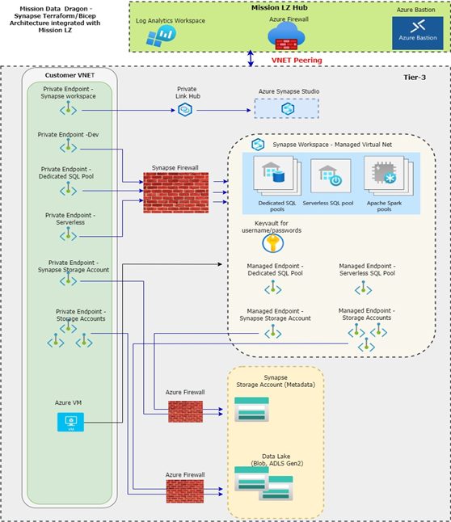

# Mission Data Dragon
Mission Data Dragon (MDD) helps our customers deploy a zero-trust secure, automated Azure data infrastructure quickly and provides them with documentation which enables them to meet their security requirements faster.

## Objectives
1. Accelerate our customers adoption of data migrations and workloads in our MAG, USSec and USNat clouds. 
2. Build upon the existing capabilities and integration with other Mission Landing Zones to allow more value to be experienced by the customer in all clouds.


## Secure Implementation of Azure Synapse 

Today’s organizations need a new security model that more effectively adapts to the complexity of the modern environment, embraces the hybrid workplace, and protects people, devices, apps, and data wherever they are located. The Bicep module for Synapse is intended to help realize zero trust architecture for Synapse.
In summary the Bicep code implements the following: 
1.	Create separate resource groups for Synapse, Key vault, Private links/endpoints, Audit or log data and Data Lake storage accounts
2.	Create required Synapse metadata storage account and filesystem
3.	Create Key Vault and secrets for username and password
4.	Create Synapse workspace
5.	Optionally create dedicated SQL Pool or Spark Pool
6.	Optionally create Managed endpoints or private endpoints and windows desktop to access Synapse Studio (Must for endpoints)
7.	Integrate with security center for Synapse workspace alert or SQL Pool alerts
8.	Enable SQL Auditing 

### Secure Synapse Architecture 

<!-- markdownlint-disable MD033 -->
<!-- allow html for images so that they can be sized -->

<!-- markdownlint-enable MD033 -->

### Preinstallation Steps

### Virtual machine/Cluster Sizing 
Please choose appropriate cluster or virtual machine size as per needs. You can pass the parameter values from the main calling module __mainSynapse.bicep__ or change defaults in modules.


### Naming convention
To simplify debugging and ease of implementation, parameter names are prefixed with __p___ and variables are prefixed with __v___. The output variables are prefixed with __o___ whereas conditional execution parameters are prefixed with __c___

### Synapse Required Parameters
The Bicep code is parameterized to allow more robust implementation. Most parameters have default values that can be modified locally or passed through the calling module (__mainSynapse.bicep__). However, some parameters like IP (Internet Protocol) addresses, Username must be changed for proper install or working of synapse. These parameters are declared in __mainSynapseRequiredParams.bicep__ for easier implementation.  The Location of main or Synapse Bicep code or calling file is __<your_Install_directorty>/src/bicep/main/synapse/__. If needed please change defaults of other parameters. 

| Plugin | README |
| ------ | ------ |
| p_loginName |  Email of Synapse administrator user |
| p_objectId | Object Id of Synapse Administrator (p_loginName) See [ https://docs.microsoft.com/en-us/azure/marketplace/find-tenant-object-id#find-user-object-id] [PlGa]|
| p_startIpAddress | Starting IP Address of workstation installing the Synapse Bicep code. Installation may fail if an incorrect IP address is provided|
| p_endIpAddress | Ending IP Address of workstation installing the Synapse Bicep code. Installation may fail if an incorrect IP address is provided
| p_vulnerabilityScanEmails | List of IP addresses to send scan reports |
| p_alertEmails | List of IP addresses to send alert reports |
| p_azureSynapseEnv | Manual for now. Provide correct suffix based on type of Azure cloud. Example: synapse.net for Azure Public cloud, synapse.us for Azure Gov cloud |

### Synapse  options/features
The Bicep code for Azure Synapse is designed to provide flexibility in choosing Synapse features or options. Wherever applicable, Synapse options or features can be installed using flags (variables) in “mainSynapseRequiredParams.bicep” file. The flags prefixed with “c_” to imply that they control the execution of Bicep code. Some Synapse options are mutually exclusive whereas some of them are dependent on other services. Please refer to documentation before enabling or disabling options.

| Condition | Description |
| ------ | ------ |
| c_createDatalakeZones |	To create additional storage accounts or storage accounts with multiple containers for Datalake |
| c_addFirewallRule | To create additional storage accounts or storage accounts with multiple containers for Datalake |
| c_allowAzureServices | To allow Azure services to access the workspace [https://docs.microsoft.com/en-us/azure/synapse-analytics/security/synapse-workspace-ip-firewall ] |
| c_createSQLPool | To create SQL pool [https://docs.microsoft.com/en-us/azure/synapse-analytics/sql-data-warehouse/sql-data-warehouse-overview-what-is ]|
| c_createSparkPool | To Creat Spark pool [https://docs.microsoft.com/en-us/azure/synapse-analytics/spark/apache-spark-overview ]| 
| c_privatelinkhub | To create private link hub [https://docs.microsoft.com/en-us/azure/synapse-analytics/security/synapse-private-link-hubs ] |
| p_vulnerabilityScanEmails | List of IP addresses to send scan reports |
| c_endpoint | To create managed private end points |
| c_enableAlertPolicyWS | Enable Security center alert policy for workspace |
| c_enableAlertPolicySQLPool | Enable security center alert policy for SQL pool |
| c_enableWorkspaceVulnerabiltyScan | Enables SQL defender for workspace |
| c_enableWorkspaceAuditSettings | Enable auditing of  Synapse Workspace |
| c_enableSQLPoolVulnerabiltyScan | Enables SQL defender for SQL pool only |
| c_enableSQLPoolAuditSettings | Enable auditing of  Synapse SQL pool only |


## Installation

#### Dependency  
**Key Vault**
>>> Key vault must exists prior to creating the Synapse architecture

**Common Environment**
>>>  Networking infrastructure must exists prior to creating Synapse architecture. 


### Steps to install Synapse Infrastructure (Standalone without Landing zone or MLZ)

**Step-1**
 >>> Optional if key vault exists
```
 1. cd <installDirectory/src/bicep/main/KeyVault
 2. Edit mainKeyVaultRequiredParams.json  to update IP address/range
 3. az deployment sub create --loacation eastus --name keyvault --template-file  .\mainKeyVault.bicep --parameters p_nameIdentifier='mddsha1prodeastus'

 Note - The Azure region to store the deployment metadata, it is not the region where resource will be created
```

**Step-2**

```
 1. cd to <install_directory>src\bicep\main\CommonEnvironment 
 2. Edit mainSynapseRequiredParams.json  to update required parameters
 3. az deployment sub create --location eastus --name deploycommonenv --template-file  .\mainCommonEnvironment.bicep --parameters p_nameIdentifier='mdd5aprodeastus' '@mainCommonEnvironmentRequiredParams.json'

 Note - The Azure region to store the deployment metadata, it is not the region where resource will be created
```


**Step-3**
```
 1. cd to <install_directory>src\bicep\main\synapse 
 2. Edit mainSynapseRequiredParams.json  to update required parameters
 3. az deployment sub create  --location eastus --name deploySynapse1 --template-file .\mainsynapse.bicep  --parameters  p_nameIdentifier='mddsha1prodeastus' 'mainSynapseRequiredParams.json'

 Note - The Azure region to store the deployment metadata, it is not the region where resource will be created
```

### Steps to install Synapse Infrastructure with Landing zone or MLZ

**Step-1**
 >>> Optional if key vault exists
```
 1. cd <installDirectory/src/bicep/main/KeyVault
 2. Edit mainKeyVaultRequiredParams.json  to update IP address/range
 3. az deployment sub create --loacation eastus --name keyvault --template-file  .\mainKeyVault.bicep --parameters p_nameIdentifier='mddsha1prodeastus'

 Note - The Azure region to store the deployment metadata, it is not the region where resource will be created
```

**Step-2**

```
1. Install MLZ. Refer to [https://github.com/Azure/missionlz/blob/main/README.md]. Ensure Jumphost is created.
2. Install workload tier. Refer to [https://github.com/Azure/missionlz/blob/main/docs/deployment-guide-bicep.md#planning-for-workloads]
3. Update subnet policy by running the following command.
az network vnet subnet update --disable-private-endpoint-network-policies true --name rg-df-workload-subnet --resource-group rg-df-workload-rg --vnet-name rg-df-workload-vnet

```

**Step-3**

```
 1. cd to <install_directory>src\bicep\main\synapse 
 2. Edit mainSynapseRequiredParams.json  to update required parameters
 3. Update the following parameters
    - p_vnetHubResourceGroup 
    - p_vnetDataResourceGroup 
    - p_synapseResourceGroupName 
    - p_monitorLogResourceGroup
    - p_dataVnetName 
    - p_hubVnetName 
    - p_dataHubNetworkInterface 
    - p_monitorLogAnalyticsStorageAccount 
    - p_monitorLogAnalyticsWorkspace 

 4. az deployment sub create  --location eastus --name deploySynapse1 --template-file .\mainsynapse.bicep  --parameters  p_nameIdentifier='mddsha1prodeastus' 'mainSynapseRequiredParams.json'

 Note - The Azure region to store the deployment metadata, it is not the region where resource will be created
```
```